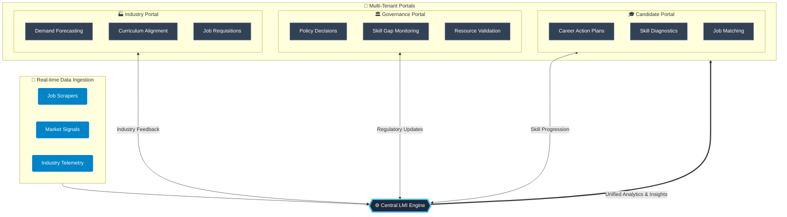

  <h1>🚀 LMI-CAP Platform</h1>
  
<b>Labour Market Information & Career Action Plan Platform</b>

  
  

    
    
    
    
  

  <h3><a href="https://lmi-cap.netlify.app/">🌐 View Live Application</a></h3>

---

## 📖 About The Project

The **LMI-CAP (Labour Market Information - Career Action Plan) Platform** is a unified, intelligent ecosystem designed to bridge the gap between industry demands, policy-making, and job seekers. 

By ingesting real-time market signals and providing multi-tenant portals, the platform aligns curriculum frameworks (e.g., NSQF levels) with actual industry needs, empowering governance bodies with actionable telemetry and candidates with personalized career trajectories.

## 🌟 Key Features

*   **🏭 Industry Portal:** Real-time job requisition drafting, skill gap identification, curriculum diffing, and market telemetry scraping.
*   **🏛️ Governance Portal:** Macro-level monitoring of skill trends, real-time syllabus validation, and policy alignment.
*   **🎓 Candidate Portal:** Personalized Career Action Plans, skill diagnostic tools, and AI-driven job matching.
*   **📡 Live Telemetry Engine:** Ingests market signals from multiple scraped feeds (e.g., Naukri, LinkedIn, Employment Exchanges).

## 🏗️ Abstract Workflow Diagram

The following architecture diagram illustrates the flow of data from ingestion through the central LMI engine, routing to our multi-tenant portals, and establishing a continuous feedback loop.

## 🚀 Live Application

The LMI-CAP Platform is fully deployed and accessible online.

**🔗 [Access the Live Portal Here: lmi-cap.netlify.app](https://lmi-cap.netlify.app/)**

## 🛠️ Tech Stack

*   **Frontend Framework:** React 18 with Vite
*   **Language:** TypeScript
*   **Styling:** Tailwind CSS, `clsx`, `tailwind-merge`
*   **Icons:** Lucide React

## 🔮 Future Features

We are actively expanding the capabilities of the LMI-CAP platform. Here are some of the features on our roadmap:

*   **Advanced AI Skill Matching:** Deep learning models to predict seamless career transitions and recommend upskilling paths.
*   **Blockchain Credentialing:** Immutable and verifiable digital certificates for candidate skill achievements.
*   **Automated Policy Drafting:** GenAI-assisted drafting of skill policies for governance bodies based on real-time data.
*   **Multilingual Support:** Comprehensive accessibility across multiple regional languages for wider reach.

## 🤝 Contributing

We welcome contributions! Please feel free to submit a Pull Request or open an issue if you have suggestions for improvements.

1. Fork the Project
2. Create your Feature Branch (`git checkout -b feature/AmazingFeature`)
3. Commit your Changes (`git commit -m 'Add some AmazingFeature'`)
4. Push to the Branch (`git push origin feature/AmazingFeature`)
5. Open a Pull Request

---

  <i>Built with ❤️ for the future of workforce planning.</i>

